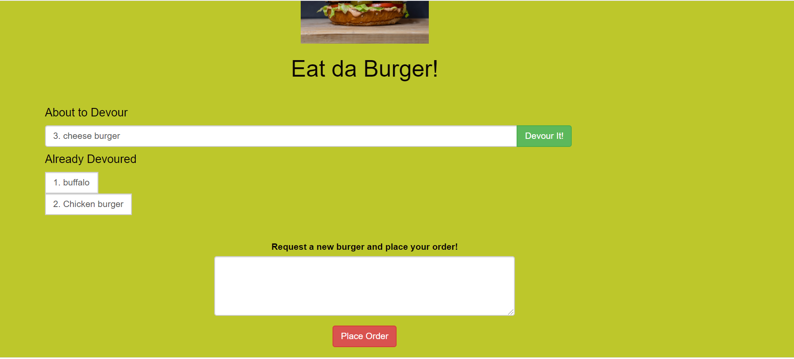

# Da-burger

Enter the burger you would like to   [here](https://limitless-sierra-48201.herokuapp.com/index) 

**project**

Open the project  [Da-Burger](https://limitless-sierra-48201.herokuapp.com/index) and in the white textbox enter the burger you would like to eat then click on submit button. The burger name should show up above the text box on the left with a devoured button to the right of it. when you click on devoured button the burger to the left of the button will appear on the left which means its being devoured. you can add as many burgers you want.

